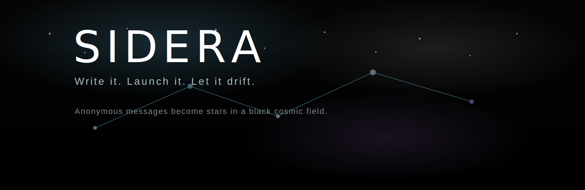

# Sidera

[](./README.md)
[](./index.html)
[](./styles.css)
[](./app.js)
[](./README.md)
[](./README.md)



`Sidera` is a minimalist cosmic message board where anonymous thoughts become stars.

Users write a message, launch it into the void, and watch it appear as a brighter point in a black vertical starfield. Older signals stay in space, while the live console shows the latest transmissions in real time.

## Concept

`Sidera` is built around a small ritual:

- write something you do not want to send to a real person;
- launch it into space instead;
- let it exist anonymously as a star among other drifting messages.

It is not a messenger and not a social network. It is a quiet visual place for release.

## Features

- minimalist black-space UI with animated nebula and stars;
- anonymous message creation;
- procedural destination stars with weighted distance ranges;
- clickable message-stars placed into sectors of up to `20` stars per screen;
- live console with time search and fading overflow;
- clean mode, sound toggle, signal receipt, and modal transitions;
- API-backed storage instead of mock data.

## Stack

- `HTML5`
- `CSS3`
- `Vanilla JavaScript`
- `Node.js`
- `Vercel Functions`
- `Turso / libSQL`

## Architecture

Frontend:

- `index.html`
- `styles.css`
- `app.js`

Backend:

- `api/messages.mjs`
- `api/destination-preview.mjs`
- shared logic in `lib/*.cjs`

Storage:

- `Turso` in production
- local `file:` libSQL database for optional local fallback

## API

- `GET /api/messages`
- `GET /api/messages?after=<timestamp>`
- `GET /api/destination-preview`
- `POST /api/messages`

Example payload:

```json
{
  "message": "I needed to say this somewhere.",
  "destination": {
    "name": "Astra Reach",
    "distance": 128.4,
    "bucketKey": "mid"
  }
}
```

`destination` is optional. If omitted, the server generates one automatically.

## Local Development

Install dependencies:

```bash
npm install
```

Run locally:

```bash
npm start
```

Then open:

```text
http://127.0.0.1:4173
```

If `TURSO_DATABASE_URL` is set, the app talks to Turso.

If it is not set, local development falls back to a local file database:

```text
data/sidera.db
```

## Environment Variables

Create `.env.local` or set project variables in Vercel:

```text
TURSO_DATABASE_URL=libsql://your-database-name-your-org.turso.io
TURSO_AUTH_TOKEN=your_turso_auth_token
```

Template:

```text
.env.example
```

## Deploy on Vercel

1. Create a Turso database.
2. Get the database URL.
3. Create a Turso auth token.
4. Create a Vercel project from this repository.
5. Add `TURSO_DATABASE_URL` and `TURSO_AUTH_TOKEN` in Vercel Environment Variables.
6. Deploy.

Because the API is implemented in `/api`, Vercel will expose it automatically as serverless endpoints.

## Turso Setup

Typical flow:

```bash
turso db create sidera
turso db show sidera --url
turso db tokens create sidera
```

Use the returned values in your local `.env.local` and in Vercel project settings.

## Project Structure

```text
.
├── api/
│   ├── destination-preview.mjs
│   └── messages.mjs
├── app.js
├── docs/
│   └── banner.svg
├── favicon.svg
├── index.html
├── lib/
│   ├── db.cjs
│   ├── destinations.cjs
│   └── messages.cjs
├── package.json
├── README.md
├── server.js
└── styles.css
```

## Notes

- `server.js` is only for local development convenience;
- production deployment is designed for `Vercel + Turso`;
- `data/` is ignored by git and should not be committed;
- old local database files like `unsent.db` or `aether.db` are leftovers from earlier naming stages and are not required by the current app.

## Roadmap

- production deployment;
- custom social preview image;
- moderation and rate limiting;
- richer signal exploration and filtering.

# Write it. Launch it. Let it drift.

**License**

2026 BERT [info@tenyokj](mailto:av7794257@gmail.com)

This program is free software: you can redistribute it and/or modify it under the terms of the GNU General Public License as published by the Free Software Foundation, version 3 of the License, or any later version.

This program is distributed in the hope that it will be useful, but WITHOUT ANY WARRANTY; without even the implied warranty of MERCHANTABILITY or FITNESS FOR A PARTICULAR PURPOSE. See the [GNU General Public License](LICENSE) for more details.

You should have received a copy of the GNU General Public License along with this program. If not, see https://www.gnu.org/licenses/.